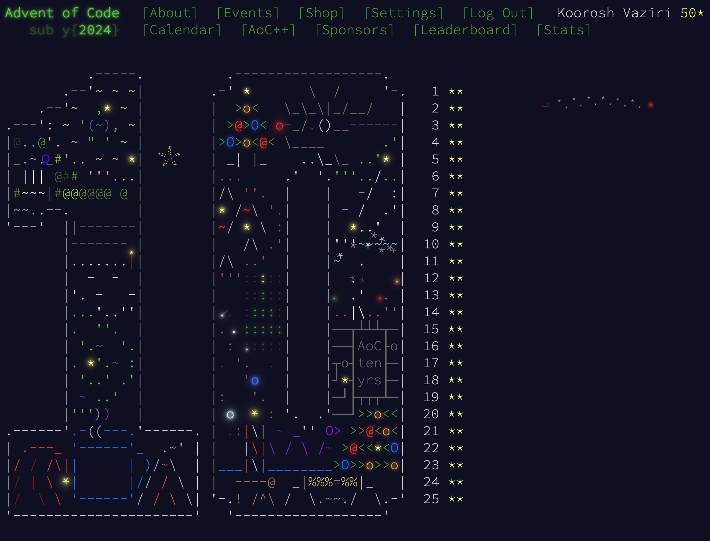

# Advent of Code 2024

My solutions to the daily puzzles from [AoC 10-Year Anniversary](https://adventofcode.com/2024).

## Source Codes

All the source code is written in Rust using the online Rust Playground tool.

Final source codes of the daily puzzles are named with their day in the filename, i.e. [day_20.rs](https://github.com/kooroshvaziri/Advent-of-Code-2024/blob/main/src/day_20.rs).

I also uploaded some of my original solutions to the puzzles with filenames ending in **_practice.rs_**, i.e. [day_20_practice.rs](https://github.com/kooroshvaziri/Advent-of-Code-2024/blob/main/src/day_20_practice.rs). These intiail solutions&mdash;while working for Part 1&mdash;were often inefficient or needed a complete rewrite to be able to solve Part 2 of the puzzles.

## How to Run

All the source code is written in Rust using the online [Rust Playground](https://play.rust-lang.org) tool.

Just copy and paste any code from the [source folder](https://github.com/kooroshvaziri/Advent-of-Code-2024/blob/main/src/) there, and they should work.
